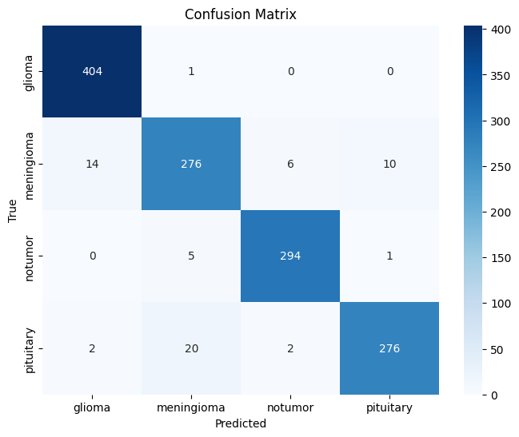

# Brain Tumor Classifier
A deep learning application utilizing Convolutional Neural Networks to identify brain tumors from MRI images.

## Description
In this project I trained several deep learning models to classify brain MRI images into different categories indicating the presence or absence of a brain tumor. The models are are having varying complexities including a baseline CNN model, an optimized deeper CNN model, and a transfer learning model utilizing ResNet50 architecture.

## Results
The models were trained and evaluated on a dataset of MRI brain images. Below are the performance results for each model:

### Baseline CNN Model  
- Test Accuracy: 86.6%     
This model serves as the initial benchmark for the classification task.

### Optimized CNN Model  
- Test Accuracy: 95.34%        
With more convolutional layers and hyperparameter tuning, this model captured more complex features and improved over the baseline's performance.

### Transfer Learning Model (ResNet50)  
- Test Accuracy: 96.4%    
Utilizing the power of transfer learning from a ResNet50 model pre-trained on ImageNet, this model achieved a higher accuracy due to the robust features extracted from the pre-trained network.

### Confusion matrix  
Confusion matrices offer a detailed view of model's performance across different classes. These are particularly useful for identifying which classes are most frequently confused by the models.  

